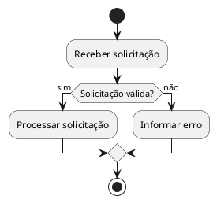
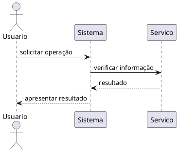
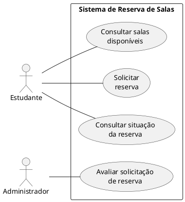

## Objetivo da atividade

Neste laboratório, vocês irão transformar uma descrição textual de requisitos em dois modelos UML:
- 1 Diagrama de Atividades
- 1 Diagrama de Sequência

O foco da atividade é:

- 20% PlantUML: aprender a representar modelos por meio de uma linguagem textual simples;
- 80% modelagem + avaliação crítica: interpretar requisitos, escolher abstrações, revisar sugestões do LLM e justificar decisões.


Segundo **Pressman & Maxim**, modelos ajudam a representar aspectos relevantes do sistema durante a análise e o projeto. Em **Sommerville**, diferentes modelos representam diferentes perspectivas de um mesmo sistema. Nesta atividade, vocês trabalharão com duas perspectivas:

- **fluxo do processo**;
- **interações entre participantes ao longo do tempo**.

> Importante: não é necessário conhecer Orientação a Objetos. 
> No Diagrama de Sequência, considerem os elementos apenas como participantes da interação, por exemplo: estudante, sistema, administrador ou serviço de notificação. Não será exigido conhecimento sobre classes, objetos ou herança.


## Parte 1: Tutorial rápido de PlantUML

Antes da atividade prática, vocês irão aprender somente o necessário para construir os dois diagramas pedidos.

O objetivo **não é dominar PlantUML**, mas aprender uma forma simples de transformar uma representação textual em um diagrama.

### 1.1. Estrutura básica

Todo código PlantUML começa e termina com:

```plantuml
@startuml

' conteúdo do diagrama

@enduml
```

O código pode ser escrito em um editor PlantUML ou em ferramentas compatíveis.


### 1.2. Diagrama de Atividades

Um Diagrama de Atividades representa o **fluxo de um processo**.

#### Exemplo



#### Elementos mínimos

| PlantUML | Significado |
|:--|:--|
| `start` | início do fluxo |
| `stop` | fim do fluxo |
| `:Atividade;` | uma atividade |
| `if (...) then` | início de uma decisão |
| `else` | caminho alternativo |
| `endif` | fim da decisão |

#### Pergunta que esse modelo responde

> **Qual é o fluxo do processo e quais caminhos diferentes podem ocorrer?**


### 1.3. Diagrama de Sequência

Um Diagrama de Sequência representa **quem interage com quem e em qual ordem**.

#### Exemplo



#### Elementos mínimos

| PlantUML | Significado |
|:--|:--|
| `actor` | ator externo |
| `participant` | participante da interação |
| `A -> B : mensagem` | interação entre participantes |
| `A --> B : mensagem` | resposta, quando relevante |

#### Pergunta que esse modelo responde

> Quem interage com quem, e em qual ordem, para realizar um cenário?


### 1.4. O papel do PlantUML

[PlantUML](https://www.plantuml.com/){:target="_blank" rel="noopener}  transforma uma descrição textual do diagrama em uma representação gráfica.

Por exemplo, o PlantUML consegue desenhar:

```plantuml
Estudante -> Sistema : solicitar reserva
```

Mas ele **não sabe sozinho** se:

- `Estudante` deveria aparecer;
- `Sistema` é um participante adequado;
- a mensagem está na ordem correta;
- a interação realmente existe nos requisitos.

Essas decisões são de **modelagem** e continuam sendo responsabilidade do grupo.

## Parte 2: Atividade prática

### Cenário: Sistema de Reserva de Salas

A universidade disponibiliza um sistema para que estudantes reservem salas para atividades acadêmicas.

Um estudante pode consultar as salas disponíveis para uma determinada data e horário. Depois de escolher uma sala, informa o período desejado e solicita a reserva.

O sistema verifica novamente se a sala está disponível naquele período.

Se a sala não estiver disponível, o sistema informa o conflito e permite que o estudante escolha outra sala.

Algumas salas de uso especial exigem aprovação. Quando uma dessas salas é solicitada, a reserva é registrada como **pendente** e encaminhada para um administrador. O administrador pode aprovar ou rejeitar a solicitação.

Para as demais salas, a reserva é confirmada imediatamente.

Quando uma reserva é confirmada, o estudante recebe uma notificação de confirmação. Caso uma solicitação seja rejeitada pelo administrador, o estudante também deve ser notificado.


### Diagrama de Casos de Uso fornecido

O diagrama abaixo é uma das entradas da atividade.

**Vocês não precisam recriá-lo.**



![Diagrama de Casos de Uso](data:image/png;base64,iVBORw0KGgoAAAANSUhEUgAAAZQAAAF2CAMAAAB+l54bAAAAYFBMVEUAAAALCwsREREYGBgnJycrKys3Nzc/Pz9DQ0NLS0tXV1deXl5lZWVvb29wcHB9fX2Hh4eMjIyVlZWYmJilpaWrq6uxsbG+vr7GxsbNzc3X19fa2trk5OTt7e3x8fH///87drs0AAAAKnRFWHRjb3B5bGVmdABHZW5lcmF0ZWQgYnkgaHR0cHM6Ly9wbGFudHVtbC5jb212zsofAAAA/WlUWHRwbGFudHVtbAABAAAAeJx1kTtuwzAMhneegvCeoHGMAt0SBLlAjW5ZWItNBchSIVJeip6mQ6eewherrDwAG6gmPv7vJ0HtRClq6h04flPUgNGe3xWNjdypDR6AOg0Rq6NoMuSVKyTBe3Zr701vvRWNZEIsklIBmHzInx1j1eY+94SG8ZmF41DClhxJhZ8AmF8S7kiy+BC8JJe3Q5kEJ2+sfAQ//g5spQx4OWzmSBuc7WxGTj5e/K+6+l9rq4nGn/E7ZH/CObWdU/uBnJ2Y65QbxgusAfgCuB8IV6uy6aJQLwtbgHKxS9bAjr2Z/gU26/qhflw/vbJS8wf8E5E4JWex3wAAJ6xJREFUeNrtfQebo7i2rSQyxqm6Os3cd9///1nvmw4VussmR0lPwoABQxXghMM6Z6otFAAtFLf23vD/gjvGBnTuB7hjF3dSRog7KSPEnZQR4k7KCHEnZYQQz/0AjYhW8bkf4bSQlnIpNE5SVjPt3I9wWvirr6XQOLuv+MY4AVqlZxgnKTeOcXZfJUQxRDL7dNaJauxRjBMIy9qlhLA/gnCAZ2wofPvgW3R+hZGTkryk7fpxArwYbN/IdMUv/QoKXbFeb38D/ld4VPd+yobCtw++ReUV3sPISXmLkY7igAKwJKVHTWJ6kOI1EuKX/z3ugw/AyEkJwHwGAGXvFiSqAmIrAkiemwHAr2CmAN+JkTpDYJWoyAZzzfSEucK6Ex+T9PoGpgdnm195+gzoC1hZNJZKEdkdULlowUJaIC0AsNnfWtlthW8fvJahCBZ3ujhSELaAokDIXjmGU/JEBBQGhp8A6gFNMddAjEP3O/KSgA0QLyrrkIJ/BeCGIghD//umjDcbgNd06CjSV+4hlCLyO6Diih9HCRAND7B6XJNlrezWwrcPXsuQB4s7XR4pi794BeBkuXn0mMB/IQiFb2+u+I299xos5uRnYrGPmH6Hv0D0D3mivgH4Ssx/iaJ0QYZtoH+Of/NfpfQpyAsNACt7G5HfoZw0mU+wiog79Qmold1e+PbBqxmKIM3u1PTWIyfFkFhzpw7+kj0s/SHJOgIw/b5D9v9XwLsKAFQZIKJJvHbYf68R7ziStB4iAGZAUv1q+g3YRcUoR+R38EpJ5QWQgGE5UwewW1fKbi+89OCVDEVQyd/l8khhXQBI/oT+JiB8NcMwtD/rmyB7NzbFQYh/benLZZ8dfqKSRh1A81RwE19OnwJ9D/+Er19LEfkdykmltJKtKPJZQ6mW/U7h+YPXMhTB2rtcEinriQREKYRZUFUBfo59HabvyGrrgS39KallCin4KvhOFmKpApl/yA3pRTGygkAtRWR3mNaTSkr4SgWtVnZ74cWD1zJsg/m7XB4ptimKJALZrkv8rIsUswYhAfwbfpbV4I+BEm8+q2ZiH+ubbJeqcxXFCfvVlH5u0/W3bUR+h92k0zAB03rZ7YUXD17LUASLd2nAyLdZDDEJ2Kt9yh4W2qs10efA0FEUEvB5Qqy1I8q1TMoMeOa8CD5KwBXSRVxDejQFYbCNKO6wk5S1Tr70q5XdWnjx4LUMRbC4UwPgKE+z/Pif4idlE1JYhAguh3gsFOBufoIrqeKip29JX4oo7tCWtFZ2a+HFg9cyFMHKu5TeePTdF/tqpHIIofdi25JJH6UvRRRZ25LWH6Gt8N0Sa0HU2kuNvPu6TdxJGSHupIwQd1JGiDspI8SdlBHiTsoIcSdlhLiTMkLcSRkh7qSMEHdSRog7KSPEnZQR4k7KCHEnZYS4kzJC3EkZIUYvDj4mMKaYpqf36gex+WEuCAV4EE2J3rhBUhKc4M0xOgFBif1tTsbpIjHmdEEgCGLzgYuj4JZISeKEUkaCIHepYKFcOTgJOT1QEsUTcHMbpNAoJhSIoj50CM26MZrEPqNVlo7bq10/KVyVAUnaQWY0UOLnhmjsY4Bk+Wht5rpJiQNKJUXfv6AKoCzzxmdTKCtHIeZ6SaFhCKTB/dWHgIrCmoxNBfXwVXitpPgRVGb7F/M+eJPBoQv1A9fiVZISBlA9OiMZBB1Q30X6IYf+6yOFuvj4baQCqAPiY1U5WIHXRgp2wUE/2o5AExCY4mT/glJcFynEgcbpFt5VqGpyKFquihSHTMqzLRpiJHV6QUvoXpvtacVZbMqHMPVzRaTE7qTyNt6KSDTWHztkDVlFv4ndRqLwHQIlKVzP9p+FXw8pDphVeq7gz3QBQbKmHfuz5CD9niI70t6N5WpIMbWa5tVa4kZsRN5QHJfIMxZtitSBEwOAyIqhtBDWCqs/G6ZWbOw4wWCZODFQuGkOUySulKpaZmnDPIYjD2Rx5dvCaWjtO/m7EiEX5SrSFeCosBhkr7QFeSas8ayDmfoWAPqClnOBAJ9bGgrDNJEiiLoOQ2kxi1IbBSxpuj2Tpy1iOLJAHleFopp7vs2VtBRzWv+6cPFq1JzPgPqL2+cQWLsJPTUhMxHUOhkZSTo3H8Eq9Sc3oYM+b67nabcxoAiAhnIYJGQ2Kv12xnWQYk8aWnwuTUyIynoVlbcKvr4TGV3Ss6417iViO2QffiJtkqYVlKXdxmyTqS3lCKqzj8G46yAlEnZfQwS5WUaa9tGQ9zJZ/cGvnv8qfGl491c0E+BvTmehJJyl3cZsk7WWIydxmxpyF1zFmOI1zHeQ6qQ1SBk9Efs3LlcdMj7/C2yAOFFJdg1SPhAttbqphE3aSkwRyMrZhebt8z7XQErzV7kkrzGgwRNFuomBG5Y6lMTnfAlA9jBwouyiGGECQQDIqlJMlhaVY/JAXs4uoJiA4biG7itolGJJ395+Q4rY4mX55ycEi9J+IflLBKxNwSz4CdW8lU2jX/T7cmXSeVguJksLyzF5IC+nAaq/x6gyejMgHWBNWyJIksnWEyJVh+OEiGkfkdS/SpKI9c4jS1uJyQN5Obuw+y1WLssMyD5A+Siw85ZiWwSSQUvaSkweOE71XcOYcnW4BlIg2b+MQ4Pss5N2DaSowf5lHBrBPiaor4EU6Qh+PWi0nznq++JR8zsmtB02V3O7pHyzdvufbjlTeHudNbsKUpSk41KN7whHUYeEbvJp92KnnCliIndN2oTrmBLPVvPOA2sXSSSAn+HAnBzEXXZN2ojrIAXMzQ+lsJa3kWZZyMiFU1ySBQx+NRODFVKwxDN8/4FH4DnwbSzN5ErOd++E7QXYC1fRfbHXWFj4/RSWOZk5fJoWRoVwKlgFc/3N3YrBcikYTyTyXTFqQuD8UZfSc1TJ+R5iZ7mnZPlKWgqAC0t+bxZKrcUUKD83gULIhR6hhs3JVgyWScF4Ikl2ZRDgCV2znGpiPVZytsMle7aTq2kpjJU5td6ZxaaSLpRtSorS8yp1bcIFVFpCt2KwTAqWwnApcDUhJrG5XuO4mrMNeC3tfzzzWloKg44tpbWx0FTAVRdypdIvQLZisHK/o68Cxf/Ec0IIVFjN2XIX1kwOcCjmikgBwiIw9ZZFm5hKueKsqSDDIE/2ciP94haeI7EmBuOJNAdDDUigrOCS52yEFxsHqc+r6b5SqIvYbF5MIN0kwM6WM4VwKvRAYhlgVwyWYuLbEwjQZB1x9aNqzl1QzxQXh/nGr6mlcEyAZzZ2YsuXHyg/JlcIpybmG1HmYFcMlkIVYr6EXK6eEIWLas46iIcnhzrffRVCrjpCv1FdJIbbL3AjnHpWFvnFHTFYGSRBhT5xo1grDOFkv7P+1y7kIkkSQSxp9UoujzZi/eK79VCWb+0mjH2g7HfOq45rIwX7fqTqnyBbwlFB/eDr3d9eAY1CIM0OrX1xVaRgz481YzNwSBIblQlU3umVum9mtdwuTA7dRja4HlKw52FtXh6sxSmggc2WjPvINtruxggR1IMN7VVcCSkpI4tdrUOoaYBwP2tSN+2hLiBRTI9HCMc1kNLGSAbEiAFx5LExRJT2WpexKUTCN2vUI6vwXTwp2PeSdxjJkdrvIJHP97VEQej52jjB3F4OEpUjto8tLpsU4ntxdRx5F2izqkxw5Kdn8lPPji1umCgG7H8k3aWHgqCcsqIumBTqeZE2HXBqRBQzGinGIOL7kQ1G2CBiM2YFnWUb6mJJ8b1ANfbs3KEogsOZJDgcLpOU0PPkycO5NOaPjgskJXZ9NPl+XdvbVVwaKdhzgf750p66Jy7q9ajvxtrDXkeqLgIXRAobSBTjEFY2Ro9LIQW7LtKveiAp4SJIYSuSWH88wrbiSHEBpISurw5ZI14uxk5K4nqCvriRbivHqEmhvoOvfv7bgBG/cex6yuymuq0cYyWFei6ZfLuxbivHSElZ+Wr3HfmrwwhJoa4LpEMcyb1YjK6DiFa/4yU4m83UUWBcLYV4LpjcdCNJMSZSYtvXlte/3fgxxkOK52Dj1laJLRgJKdhxpelN7AB3wShICZ1g8mUUTzIODKqKxKcUQu1A1eg61LheefsQDKhY7AjcgQ/xk+n+/hdYvyXPb3Iv5R30JyXyp+lnjSbU0vecK8V2oH89i3/LUaM3KdgvVJLh3NrLY2hgJ8a+dgCuEr1JqdhGnFrDFfldG04P7VfuStCXlKSihAOlZNhoTxxHXt7ujuMH6FunfvXjVr1pzwI4EtvT71PgdvStGlpdc6MB9uMiOzRu5VzKMJz8ew2tZPZp/2KuGicmxbfAfXT/EH1JgaTS8fSz9Ora6L5Q7IC+pGhVw/JB901E6trSfcLVCX1JEd2y4zGadNUBZHNg5YbOOO6H3mOKUV492h1dHxDb1cY2B6aEEIABabU9iBBAEAro9HsOvWtK0K1p9pjU7uYRllEylh0uijHO7EtBxKpc5rqNbY9NAaYkJtmsX2A40US+/+crGbaoprvE2OhS05yS8x/gSmKc+n8ShM4+S1HVsBfGccDnNVAUxfHp0QvzxKOR3E2ewig575k6GkcEUFaT8p5Pke+90iTh5EBp3wLbMaijF6egm4NJYnlnpARHMaBI/MiWUU/A1E4CIImHWcOTjzF5Oeboe0ZKaBRRKsjK8foZJHNZEo483mYOPGAekRT6rJ2HkjCkUNJPcmtB01h/5mNw0PZ4RFLg9+NXyg74YCyf9nxl2p9xYuRDGdIZ2eJhP0QBFU/TQnYginz7m4raIW5/PaREPputn1W4zEaZxCXC/p/FlZBCvESejkDcLxoAO7TzUqitlO5JvbLnmNAqF3Lm3fjIh932Fk4BYQpCcz+LuD1IqdR8t3XKSRD6o2gkJSgK8chkeCd08d1XEFQNntIQo072Ii3h4x3uDmne4gdX25FIIIN6yWDD9xdOCrblqg1ab0UkGusdjNuGrMLfxPcbfCRMPkiSxIs/tCkFnFCXGsPG/MsmxaY1Q83Bn+kCgmRNu/VnyQfJHj9MInxpXY5Bg9jiIJuTl0wKMXc6iLXEvWiIj4WXra2brcyb1lphUyN7457LjhMMlokTA2WOeFLiSumhjtzzloVommSbK8wT+06C9CmI8nBxwxLQLFx39+BWynfumh2OyJrXOcFRLnXLvWwVbrZyb1o+dxkUbnyYK4Ko6zCUFrPoFWySprOZwvNWGG2SbHPliZ1XaWngbXh7wwoUYz3AM+jltpQw3LVojvP32XrZyt1sNXnTkpHESOAjgvKTuzBFnzfXS2k3SbbIEovr+bwclko3rECY21rvU/AXS0ocNA7AmZhw62Urd7MlSs+61rhrjO2Q8PO4oDDy2Z42T0yJVs1cumEVcGai3gchzl25A0HcJsv/IshqZetla8cP1w5e0UyAv1M7xeCjtHlimhebZy7dsI6Z2Vff+VLHFKfxyAZSnbSpUHHjbqtcrcj4/C+wAeL1lu9NQMrHoeVOB5OlzZOAIleeWMrYLzI33DAHnNo9X+5CScHNfrHAkrzGgAZPcMfLVu5NS/YwcHK/XWKECQQBIKtKKWXPWzwJKHKhLDHS2QBOwyLc5tYrhQA+cAxax4V2X37Lbpv07e03pGgGd7xs5d60ZsFPqOYD/jT6Rb8vVyadh+VSyp630iRSngvmiR/efiOifS7CLW69NtCCfsuVoT65jrv39aFPLrP99iTZHHHY8bKVe9NK6l8iSXbcbO163spzFYnxSppXMr/j1sv60PXNyXxy/The1ne0YnIHWjtvJoKWCLQ7ZxVbr+SJaaJ480rmw1XlMUkZ7oLu45ZyxMfuCBscw/NTigsdU0R8bvkJ7OHQq68O4oXOvjTv3E/QB35PSeSFkoJgz1nmOZHAnrU8kBQaDVB2PCQMZ9gD2M7JH5W6HXUTCgwkxZyfeajtv0zeIAwHZdsD1OotrB5GimVIhjUo58Eg6NaZG2s3UKuTbkIFg2ZfriICUXFP4smtFdKk7+taXirbKuRUHJlgy7exNJO30q08nEbr/gNL6eB5JWc3JO6s/3c/pKUEkO8mKDA4TO0OhTh3e/VFljmZOUFJLpW+SyrYcv6oS+k5KqRbeXgTLfJdL2rCas5O8IIhxv4GtJQ43qyndVs4rxIjnAeW3vkFqLWYAuVnWajFwQVbdM2i1MR6zKRbRTiTe8muDAI8qeX8GJE/zMxTf1Kwl69kp2b/7vKwUFXHn3T8FFMxFFLKQi0O3uhjEpsU4EISVoQzuZexXkBXE2o5P7yhJw00J9SbFGpv7zQfdCzgoDCIS7udjtzIpWBZqMWBNlEQAhXm0q0inHXv+ipQ/E/1nO8jCsTB2zC9STHLt5qbw01LHQhoSl2sdfh4xVQEFSs4+p6LqHJIQMlEAcgwyJM9L8LZVc3BUAMNOVtAg2gfn+h9hyGzMumG0xHsDEJjji3nwxU+0k0C7GQrlypFTdYRl/rn0q0inGPi2xPYlLMRkeVIi33OePdsKXUlbUG3h9iWOjQ0jXhYUt7/wpYvP5CkbeVU5ajVE6JwUUi38nAOVYg/gcacO4gDuk8jSdFPyOWhHdMqATnCkfsPt+6bkPgEqe9+ZDFMoxuEWuwaEngfkEu38nA9lfge8TQKoTRMnWu4kCuku+ZuVDccicEVcQpI4AG5XZU6nwU3zFProjHUOJdF7TNcmoQEqocRsfQhJQmbhLATq8W7O33SpyfehEas1cY+ofLxdNwb3zSOCDygGlkPUojTPNWarZt3EuBX62lyalpYc5BSYrh+6AnuTZMIw0MSwtFHk6utbc5b9qbRYmo9GedQ6OHE0IgxA45osyNJEgKBpB1+Ad2DlFapAGyNEZYz6/dZaGFPpfCxLolDNstFonBAuTdOMFeQEAeO6R/j2DJ6YTm1fk/Pp7UrZvOt2Of/IgENN2+NMSHpakg4tGWRnYc+frU8JIyW865mNjY7GDkYR/mRVQEiKADwTvUyBjAlNF+WCoKITrPX10xKkh5Uhu9uXtiwq5ST0WL+mvWViR4DCG1fCbPajgB9ZyeALVQEKMPTb7o2k7J2eX8jFYpjTYp/YRMpLRqC4qfYskZByxbCeI9XtTyY8q0STDqU9H5CaYS0jBYffC2xycWjXhS/ggdhpebqgpYL+SAR2jHMtAWpAwwD2JuEvo3FeX3xu6Flcu69/kvAB+urJy4epYogTSZoo/gXhIyTtTFPBavych6+8IurYK79DcAmofOqLqWn3T1u6dPn8Ld9EccdzouWlhL+P/bH+JSQucCV/4SqoQ9zOQXqf5lg9T8uHhUegRZ4qpwmXPFobDac6+St5ZwT5AtBCykyF00jtj560rWdTciEK/zxwxPECvFWW1DKJjIxidfsavO0RvqUmHdaPkALKTC7/t31X4SvtUQbwSrr+J4F1pB+8f4Ibq7n0SyotnWM4ie2bjEG2mK4DXww0EPDoL/t5SawUfyTuX4fayqRiqN/xYb5llgTpu4meMDWk34AL2vXipYPlsYMCcBsNKeUzegjbjJZcUmq+Af1dSZY9QH9W8nHE6LJKq4IU3chLL/B51XnifatoaWlRL/YH/i/5JUIWJ+C2Z8f9B9p7v8HNd4IHl7+Q7IO4MObSRYV8Wia8NPbL0Th8t37ovnUeVFmd+v3TfhIHIxJ2ZZ4ku85ZBqANGneGKdJl10i7idi1ijLGyQOvmj0EgdXN1XF2o+23THYqQWwAct9Q7O7R5U6zrz/M5n41np63pPi48PZN+U0LbLN+wy5grOTwhaqn7DzpBn3Mb/ACEjh9pdm7l/BuPujzzAKUtIxP7DXRtcT9FeOkZACuFpD7PzWjD39dl8FxkMKANJy7r0B40zW6keEMZGSaiJEjqnduoByXKQwyA+ENRfnpiWUI+wqkPENRL/eTq7wPh6MrqVswJrLmkz2suJ/wRgpKXx0id1naaLdYjc2VlIYpMXCd1f65PYmySMmBaRqc+6K6rfWjY2bFK78O+XdGDdtfjsYOykg7cYCd63qt7M1dgGkAL4FQ33nTddHol15bFwGKfywho7ZLFnXb2GH/1JIAdwD2TRx/zB2LuiZh+GyXlCczyPvFenj8VV3nNc89wP0hSwvQu9Z1I+g/zkaXBwpgHvsW4aeKesHcQk7RlwiKSDlJfDWh+IlwQmh+VFoCOBhlYn740JJAXyaDHx/LWt7ycRoFHFle0EuG2KhGIcuY+eY7uzfxeWSAvguDAhYP6YNHF+igEK5gVO40fOmkU2Bco6jghdNCkjbS+BbA8b9MAAf+K3n1hFoZFHp5DvVl04K4Lywcd8SNa37u2CPyJ0cwHBiYguop91KuAJSwGY+5r9CvYvZQm4rGPUZiCSJBmxOccLXuQ5SAOdlEfl/qf6hV8XEEfsai4GaFp2SlqshBfB15Tz2V1h7b9+S2nA2ZIiQ5WilnWrQvyZSAO9qZolvxprWYmAoCAYbIJNlfz3ARPoQXBkp/I2mU+K7b4q2u7CklrSPPUFNsZSTCHWujxTATdpOqM8G59oCBlt7Kr+iuX9cr30ZrpIUkMpf+AJG0LYTssjb3964Fq/6eYUYhGslhYMtYPiETNPSgT8Kiq6LhhhJpTe3hEn6XzncAmlmHp+VayYFpBOybOCP/aLjCf9QCSeLbUcUMhKiEhHsd4uNLNaFnYCVKycF5AP/St8O8X+VTzCzM7fFY/V30trToXlvr9m9H/kc9XRqsIF/tf3wacLHlvTFHZfImS6/hQwAfCdB+pT9pnGCwVIoXAtlDolSwOmx3S5cq5yoBqu09wgFO9zITuyVtiDPmyYTRoyjV2lpYP5bEUR+1KxwLbRxSJRBUN3jPu1NtBTWGZXf8/HvM1QmE0DN+Qyov6z8u6fred7HyUjiHGxdC6Ueh3IoFjnqx3wbpDiVUVv5Jwz9v9Ey9T0E1cJaXEzqS8Ota6Hqzo1hH81vMMdNkBLXfZIrymxlL2jaecNixN+YzCpj61qo2jIQOqrv4psYU7yGzREJUBGwcST1P5Rf2ppYhJwJHC1bNp31o44qN0FKtQXQP2ycj20ZId3EwA0LDUukr2O2sEx/ixEm77gWQke1hHkL3VdUE32RFwqp+gDA8s9PCBbb4eLh7TciWjqkT6Nf9LvU7lpI6u5YsD/6eRo6FQ5rWsquyxkpppnBrIRUhxuMq2abWl0L4eCwKszDPQ1dKGi9XmHdRFaBunuCVtdCAgHHw22MKReGOykjxJ2UEeJOyghxC6SgIwzK+JgVdwukKEewKBId88zkLUyJpZ1tlo14xLdxaoI3srg/EgHk4TRW99nqEjh4XshUKoiPeTTvFlrKZiOrjFQ84vxRl9JzBOgL90dCQB7exIrcVjk1SzKVMu5b93tD9+oHIdBnQH8upkBNrMeEzESgAbrOwpnwRHZlEOBJSaZSgndUq703QYqIaX3vPvUoYlKAMRClZ11TYBHOhCfGegFdTSjJVLbA9N5S9obh1Fwaoo1HEQhUCOBXz38VvhThrE/XV4HifyrLVLZwjirjuhFSBBTtbGJJhUcRZBjkyZ7XPIwgzcFQAzj6XpazpPCP5Qo1v/WZq+tEMPwdx0doso5SjyKJz5uBUIRzTHx7AptkKhE+8vH722gpAMzXO2dWl6snROECkL9EwNq0COdQhZj1XnBHppIEx+28bkOekoKYuyeJSYJSreCEbKQmebieqiJTif1jcHJz8pQUaG7uaJfk0hKxFm5OtUEYHbud3MyYwt90Ycf7l+LgE+hC3A4pAC6ifc+gYFM9ha+Xm+m+OIzYnOzxwtQj+2u4dMFNkQKkheMP9jwRhJMTWYC7LVJYYyEOHGTNJQi1I5+13+LWSAFohl3QwzhFCuph5WSU3CApbO0+o54nqp2bCw0jeFrLyDdICpuHTUDiEUHtUNMkjIF6/JVJFTdJCn/vKcBBAkT5nQpI4hgg9ZRGWfKHO1+9nBtc8zSJfAqgKKBKPSQEJ5TVzUmt5JRww6Skr8/fnyY48gvP7QACAZ3exlflqc5dLSMAlEZmgfqGtlkuB3dSRog7KSPEnZQR4k7KCHEnZYS4kzJC3EkZIe6kjBB3UkaIOykjxJ2UEeJOyghxJ2WEuJMyQtxJGSHupIwQd1JGiDspI8SdlBFi0MGJxKcUwr5nP+/oigEVix2BH5EmfrKnO5I7WtCflMjf+BlDE2rpH3klu2MIeo8p2C8cjcH5riL0HQdAb1Lssu2GqX3u579K9CUlqZiMhVJy7he4RvQlxa8aW1D9c7/ANaIvKTXzPcc1L36ruC8eR4g7KSNEX1Jg1XIpOacax9WiLylaUAkGJ3HbemvoS4qYlId2mtz3v46A3pVq2CWLMfZh/VWcFIRiSijArfNHKAAgABGeftjtTYqgW9NsIKG2fmk7kpghGxUR5DXO/mlLSwmgGAQ0Ty8g8USv27/7kQw7tQxAfGxcDCc4SdJtOkEQ5K5fPm8ppeohBAdZGeKRO+0BxQvzxKORfCHyFK4MzytS2fcDQrlaN8ahRyEQJfFYU89BFStOwUn8su+JKCJcKVs5cN2xxsb/SZKAQCh1bng9cBFfe3/gMGEdrXbMMXqjgh+7jBnlwGKlKySFEUJF+TQLKCgzPkhsUXRIYq6NlDCkgnLiFS1SFEBDi4pdLPB0wTWRQoMIKMZ5Nn6gqgLsY6QewnjF9ZAS+VA97+xDmLDvwhO0vdvLlZBCXCJPR7A5CjWNrd+kPa0f9SDFK4t+Q6tcyJlMMOVIvGF2IY8CNAGxKUz2+UJ6kFKp+RGtU2JPONNA0gZJwjYwhn8mF999EVus9VsRan4pi/X5/L+PUU/ZnustfnC1Bp9pwpQ4cAoGYjStfiBcx9CrnARPL81Jw5Av8rsUWk/Jf79ZDQmTePHHa55voalqDj1VctkthVj6znDmKGHY6u/vsXPRj7XfSVMPKXyB31tLEGehORvUr140KbE73WnpxH+0HUaK3+gS0EIGyC9s/Aryq7lPQeCwSdxMKlIC30mQPuW/7TjBYJkUZW1ioiJcyrmFIprGkAq+5O4rDOa7j+8ideJxq5yNLgFDdjG/kHoO5Bdzn4LAXmkL8kyKlM6rtDRw+lsRRF2HRVlZTBEu5yxBmLlDPFFccEuJw6aR1NWh/uZNgNTqErC4kHoOBNy4aupTkFE4nwH1l5Xb6qbreWGRWEZ88ZFnzWOKcC1nATizBrg8uFxSiNtkwzmKHgDUnck7LgGLC/nIk/kUZOSofL+k+LZjUt9Ey7PmMXm4nrOEqdXfk8TlkuI0zjhdsErljGK7S8DiQt73ZT4FRZpe2R6ioqBenXnWPGYbruYsARpO76nxxY4puPFAA3UnDDPBSV0CeqlLwKVW2VXfucB9Cn7+F9jsA+XT4Lj4TiuuBLmr2yJrFlOE6znLEGhvJ98XS4rfuD/vk7nBMHFpq0vAXR+BmU9BgHQTAzcsTuggfR0DmjmuEyNMYJ41i0HbcDVnBXrv5crFdl+4cS/WVdIXmliB1uYScNdHYO5TECz//IRgsV3kPLz9RkTbTAem0S/6vciaxRThes4yhN7qIkNdCh5376uDS0Gz8wPUXAI2XCh8CrIfFf0bgLEgNGfFK2leDtdzluuqg1eJM7kU/HHYxN1Hzx1HgbueA8WdHxkEoSUrTRRvXi7qkBV5OlL6+NPs0FIcfN5DZzbo6lWl/4Ne7JiieWc9Mgu776L1911/sbOvATPN8wCD3i3lYkkBk0GaybZz6ud0+rfogaTQ6OzKjoI+pH7DcECmfWAP8Cs5kBRzbp745XYhi/t6nT0BHGXAmaNhA71liMb5pfRaYPcSzlseTLsS38bSLJvLZkKV/FIuWcnDabTeKJrpgoGGUga1FL5uFpXzf6eqbvYY7S1zMnMCVrt/1KX0nEl7N0KV/FIuWSmSpNHNopkOSMzpoMOsQ1pKAPl+goIDdUDmg0JcWJ2PN1FrMQXKT0DX7F81sbI5LReqFJcyyUopSSpzaRXNvH9DBy4Hvlb/LHG8WU3rtnB2B2NwHq07ullOZR5IATGJTQpwbuqHf1/FpUyyUkqSbme1imbeQxAOEgVz9M+HvXwpOzVHoMoly46vd3mLjQwE8n8hBGo+GKFN1OZSJlkpJUm791bRTDuCUB3ubLg3KdTe3my+Po1/9vdhANfVP/56xVTeEbPZkFLv8baXkGGQJ3teS4I0B6eime8VEUs7/GgPSgYM9GZ5y2cEE2OOySI2/Y8+YMRnBXYC0GTNxu24bA+guJRJVnaStIhmmoEdS1jsNdz2bSlm5TginJqndnbcjAmIbPBBL7Z8+YEkjf27ekIUVr7k/FIuWaknaRHNNICGoTBguVhFT3mKXde/iIPBhzPfQYdd4ob68BKkvstLDDfRJEFCrd/NL+WSlYYkoEkSU32CMAKqAoZgD3mKt+PQVcLemY/cF4ATQHwPvqO2k8fsClSKS2J7ktarG9DgYE7Se5ES0t2uUnXDYd/GMYAmgPo+SPX8TwkahxQezkl6H1KSsGlnZWIJYxLKQJ3rqxAgySeartM4IkA5qMZSj/okTvM0b7aejUwAIE75YIeBIB/N/sAG3HIClA+uHdNHk6utw5y7I7Sbw0c/EgaAIvEY9gdIEmMABfkoA2oPUlprHo6QkxRI4yeEY59wQyvigVpNkiSErf2lIyr0jWk4OA5S+wOAJknIFoZUYBhUm4QbQOK0iqJy7N76+knZAGaTeYKTKLcVhRBga5HW+QDmlqUIzbSFkCCcaupQJiUqHXKy611SRe2vi+agPc5ODaFiGYNZnce84luQEibDM+y5bkkJnqV/ikBYr9KozEMp8Ca2CCDDcZJSgjDabmL7XI4avLMMfGwJ3M2qHwEFKcT7DJyUFMtNlY25eBrMNctFc3WjAmiK1AGGsQnEJpdme1H8Ch6EVJRt2DHcSLCzErgmIJYXYkm78I4uKEhxkUb+PrBBzVovRSvWQBCr8+DFAAv/5X8QCFhCfiX6K6pp4GmypCFVBNaTsdhYnsFQNqj58m1bArBXC8n+/S9Ko8/9pheEghRnAvS//ISluZwC9T92RXgEmht/Y3/8bAjhVwIv3f9KyFzgeoLCRkaOvgAeAsp/sbQtYb2YAe2HtUij7+iMnJQ4egRwYk9YbbPK3ZyM4NH8j1CWZ0ubgCg96dp2e5L/IlaINwqAWQnpD6BFm+g7OiMnxQF/N7qCG1F2qsIH8j850kAm4fvu+i/CV7EU8yywxvMrVwhEhVScAnDvu3ohX5w6XCttLjqZ+t7H1jKg8fn/wPJxXhw9qKneTFGCmAq0o7FOPMeLjBSPLFJdQQdAfZ2Ksj8ADlhLoGyqHxGal+QDyprbtgQ4WXFNwGOIJq8b2WfsbMwfGmagPrz8hz7e/CSvRMD6FMz+/KD/pItk+PBmkkWqEJiX8PDyA9Hl3cNdXzTJ6JNOS11M6jt7NMk3YosSMBm0NztIRn/R+FBG320QEHY2haC0U4Jw/tN6F4iRyQzv4BgnKf1Vzy8cSaVHGScpunV2RbGTglqVmdU4FxHzt1+3xYpWOf8wTlLAw7kf4KwYZ/d147iTMkLcSRkh7qSMEHdSRog7KSPEnZQR4k7KCHEnZYS4kzJC3EkZIf4/ujPfYiCn92cAAAAASUVORK5CYII=)

O laboratório deverá se concentrar principalmente no caso de uso:

> **Solicitar reserva**

## Missão 1: Diagrama de Atividades

Criem um **Diagrama de Atividades em PlantUML** para representar o processo de solicitação de uma reserva.

O modelo deve deixar claro, no mínimo:

- início da solicitação;
- escolha da sala e do período;
- verificação da disponibilidade;
- o que acontece quando existe conflito;
- decisão sobre necessidade de aprovação;
- aprovação ou rejeição, quando necessária;
- confirmação da reserva;
- notificação ao estudante;
- término do processo.

Não é necessário representar telas, botões ou detalhes de implementação.

#### Pergunta que o modelo deve responder

> Qual é o fluxo seguido por uma solicitação de reserva e quais caminhos diferentes ela pode percorrer?


### Uso do LLM na Missão 1

O grupo deve usar um LLM como apoio.

#### Etapa A: interpretação antes da geração

Antes de pedir código PlantUML, peçam ao LLM para analisar o cenário.

Exemplo:

```text
Estamos modelando o sistema descrito abaixo.

Antes de produzir qualquer código PlantUML:

1. identifique as atividades;
2. identifique as decisões;
3. identifique os caminhos alternativos;
4. indique informações que não estejam explícitas nos requisitos;
5. não invente funcionalidades.

Depois apresente sua proposta de estrutura para um Diagrama de Atividades.

[COLE A DESCRIÇÃO DO SISTEMA]
```

#### Etapa B: geração em PlantUML

Depois da análise:

```text
Agora gere o Diagrama de Atividades em PlantUML.

Use apenas:
- start/stop;
- atividades;
- if/else/endif.

Mantenha o diagrama simples e baseado somente nos requisitos fornecidos.
```

#### Etapa C: revisão

Antes de aceitar o modelo:

```text
Revise o código PlantUML gerado.

Para cada elemento do diagrama:
- indique qual trecho dos requisitos justifica sua existência;
- destaque qualquer suposição ou decisão de modelagem.
```


## Missão 2: Diagrama de Sequência

Criem um **Diagrama de Sequência em PlantUML** para o cenário específico abaixo:

> Um estudante solicita uma sala de uso especial. A sala está disponível, mas a reserva precisa ser aprovada pelo administrador. O administrador aprova a solicitação e o estudante recebe a confirmação.

Vocês podem considerar, por exemplo:

```text
Estudante
Sistema de Reservas
Administrador
Serviço de Notificação
```

Outras decomposições são aceitas, desde que façam sentido e sejam justificadas.

O diagrama deve mostrar:

- quem inicia a interação;
- a ordem das interações;
- a verificação da disponibilidade;
- o encaminhamento para aprovação;
- a decisão do administrador;
- a confirmação;
- a notificação ao estudante.

#### Pergunta que o modelo deve responder

> **Quem interage com quem, e em qual ordem, para realizar esse cenário?**


### Uso do LLM na Missão 2

Exemplo de prompt:

```text
Queremos modelar o cenário abaixo por meio de um
Diagrama de Sequência UML.

Os alunos ainda não estudaram Orientação a Objetos.

Portanto:
- trate os elementos apenas como participantes;
- não assuma classes ou objetos;
- não use conceitos de herança;
- não invente componentes internos desnecessários.

Primeiro identifique:
1. participantes;
2. interações;
3. ordem das interações;
4. decisões de modelagem necessárias.

Depois gere código PlantUML simples.

[CENÁRIO]
```


## Regra principal do laboratório

> **O LLM gera uma proposta. O grupo continua sendo responsável pela modelagem.**

Antes de aceitar qualquer sugestão, verifiquem:

- essa informação realmente está na descrição?
- o LLM inventou algum participante?
- o LLM inventou alguma funcionalidade?
- existe alguma decisão importante que foi ignorada?
- a ordem das interações faz sentido?
- o modelo responde à pergunta para a qual foi criado?
- existe algum detalhe desnecessário?
- o diagrama pode ser simplificado sem perder informação relevante?


## Alteração manual obrigatória

Depois de gerar pelo menos um dos diagramas com apoio do LLM, o grupo deverá fazer **pelo menos uma alteração manual no código PlantUML**.

A alteração pode ser, por exemplo:

- corrigir uma atividade;
- remover um elemento inventado;
- alterar um participante;
- mudar uma decisão;
- corrigir uma interação;
- simplificar o modelo;
- ajustar a ordem dos eventos.

O grupo deverá registrar essa alteração no entregável.

#### Exemplo

> **Alteração realizada:** o LLM adicionou um participante chamado `BancoDeDados`. Removemos esse participante porque a descrição do sistema não especifica como os dados são armazenados.


## Cronograma sugerido: 30 minutos

| Tempo | Atividade |
|:--|:--|
| **0–5 min** | Tutorial rápido de PlantUML |
| **5–8 min** | Ler o cenário e identificar fluxo, decisões e participantes |
| **8–15 min** | Criar o Diagrama de Atividades com apoio do LLM |
| **15–22 min** | Criar o Diagrama de Sequência com apoio do LLM |
| **22–27 min** | Revisar criticamente e alterar os modelos |
| **27–30 min** | Preparar o PDF e registrar as decisões |

> O limite de tempo é proposital. Os modelos devem ser **simples, legíveis e úteis**, não exaustivos.


## Entregável

Cada grupo deverá enviar **um único arquivo PDF** no Moodle.

O PDF deve conter:

### 1. Diagrama de Atividades

Incluam:

- diagrama renderizado;
- código PlantUML utilizado.


### 2. Diagrama de Sequência

Incluam:

- diagrama renderizado;
- código PlantUML utilizado.


### 3. Decisões de modelagem ou de projeto

Incluam **3 a 5 decisões** tomadas pelo grupo.

Exemplos:

> **Decisão 1: Retorno após conflito:** interpretamos que, quando a sala escolhida não está disponível, o fluxo retorna à escolha de uma sala.

> **Decisão 2: Serviço de Notificação:** representamos a notificação como um participante separado no Diagrama de Sequência, embora a descrição não determine como essa funcionalidade é implementada.

> **Decisão 3: Administrador:** tratamos a aprovação como parte do mesmo processo de solicitação, porque o resultado interfere diretamente no estado da reserva.


### 4. Uso do LLM

Informem:

- nome do LLM utilizado;
- **um prompt principal** utilizado;
- **uma sugestão do LLM que o grupo aceitou, corrigiu ou rejeitou**;
- breve explicação da decisão tomada pelo grupo.

Não é necessário incluir todo o histórico da conversa.


### 5. Alteração manual

Descrevam brevemente:

- qual alteração manual foi realizada no código PlantUML;
- por que ela foi necessária.


## Checklist antes da entrega

Antes de gerar o PDF, verifiquem:

- [ ] Os dois diagramas representam o mesmo sistema?
- [ ] O Diagrama de Atividades mostra claramente decisões e caminhos alternativos?
- [ ] O Diagrama de Sequência mostra claramente a ordem das interações?
- [ ] As interações são compatíveis com o cenário fornecido?
- [ ] O LLM inventou algum elemento que deveria ser removido?
- [ ] Qualquer suposição relevante foi registrada?
- [ ] O grupo realizou pelo menos uma alteração manual no PlantUML?
- [ ] Os diagramas estão legíveis?
- [ ] O PDF contém os códigos PlantUML?
- [ ] As decisões de modelagem foram justificadas?


## Observação final

Não existe necessariamente um único modelo correto.

Diferentes grupos podem produzir soluções distintas e ainda assim coerentes com os requisitos.

O mais importante é que:

1. o modelo seja compatível com a descrição fornecida;
2. as decisões tomadas pelo grupo sejam justificadas;
3. o diagrama seja adequado à pergunta que pretende responder;
4. o grupo consiga avaliar criticamente as sugestões produzidas pelo LLM.

> **Nesta atividade, o LLM ajuda a escrever PlantUML. O grupo continua sendo responsável por fazer Engenharia de Software.**
