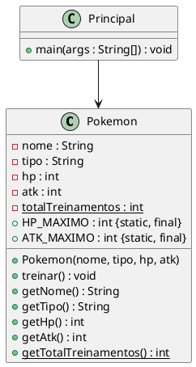

Você deverá desenvolver um pequeno **Centro de Treinamento Pokémon**.

O programa permitirá cadastrar três Pokémon informados pelo usuário. Cada Pokémon deverá possuir:

* nome;
* tipo;
* pontos de vida (`HP`);
* pontos de ataque (`ATK`).

Cada Pokémon terá seu próprio estado. Entretanto, a classe `Pokemon` deverá manter também uma informação compartilhada por todos os objetos: o **número total de treinamentos realizados**.

O jogo também estabelecerá dois valores constantes:

```text
HP máximo = 200
ATK máximo = 150
```

Depois do cadastro, o usuário poderá escolher um Pokémon e realizar uma ou mais sessões de treinamento.

Cada treinamento aumentará o ataque do Pokémon em **5 pontos** e incrementará o contador compartilhado `totalTreinamentos`.

### Tarefa 1: Implementar a classe `Pokemon`

Crie a classe `Pokemon` com os atributos:

```text
nome : String
tipo : String
hp   : int
atk  : int
```

Todos devem ser `private`.

Crie um construtor:

```java
Pokemon(String nome, String tipo, int hp, int atk)
```

Utilize `this` para inicializar os atributos.

O construtor deverá garantir que:

```text
hp <= HP_MAXIMO
atk <= ATK_MAXIMO
```

Exemplo:

```java
Pokemon pikachu =
    new Pokemon("Pikachu", "Elétrico", 100, 55);
```


### Tarefa 2: Criar constantes

Adicione à classe `Pokemon`:

```java
public static final int HP_MAXIMO = 200;
public static final int ATK_MAXIMO = 150;
```

As constantes representam regras que são válidas para **todos os Pokémon**.

O construtor deverá impedir valores maiores que os limites estabelecidos.

Teste, por exemplo:

```java
Pokemon teste =
    new Pokemon("Mewtwo", "Psíquico", 250, 180);
```

O objeto deverá armazenar:

```text
HP = 200
ATK = 150
```


### Tarefa 3: Contabilizar os treinamentos

Adicione à classe `Pokemon`:

```java
private static int totalTreinamentos = 0;
```

Esse campo não representa o treinamento de um Pokémon específico.

Ele representa a quantidade de treinamentos realizados por **todos os objetos da classe `Pokemon`**.

Considere:

```text
Pikachu treinou       → totalTreinamentos = 1
Pikachu treinou       → totalTreinamentos = 2
Charmander treinou    → totalTreinamentos = 3
Squirtle treinou      → totalTreinamentos = 4
```

Implemente também:

```java
public static int getTotalTreinamentos()
```

O método deverá permitir consultar o valor compartilhado pela classe.


### Tarefa 4: Entrada de dados com `Scanner`

Na classe `Principal`, utilize `Scanner` para cadastrar **três Pokémon**.

Para cada Pokémon, solicite:

```text
Nome:
Tipo:
HP:
ATK:
```

Exemplo:

```text
=== Pokémon 1 ===

Nome: Pikachu
Tipo: Eletrico
HP: 100
ATK: 55
```

Depois, utilize os valores informados para criar o objeto:

```java
Pokemon pokemon1 =
    new Pokemon(nome, tipo, hp, atk);
```

Repita o procedimento para:

```text
pokemon1
pokemon2
pokemon3
```


### Tarefa 5: Método `treinar()`

Implemente:

```java
public void treinar()
```

Cada treinamento deverá acrescentar:

```text
ATK + 5
```

O valor nunca poderá ultrapassar:

```java
Pokemon.ATK_MAXIMO
```

Além disso, cada chamada de `treinar()` deverá incrementar:

```java
totalTreinamentos
```

Exemplo:

```text
Pikachu
ATK antes: 55

Treinamento realizado!

ATK depois: 60
Total de treinamentos: 1
```

Depois:

```text
Charmander
ATK antes: 52

Treinamento realizado!

ATK depois: 57
Total de treinamentos: 2
```

Observe que `atk` pertence a cada objeto, enquanto `totalTreinamentos` é compartilhado.


### Tarefa 6: Escolher um Pokémon para treinar

Depois dos três cadastros, apresente:

```text
=== Centro de Treinamento ===

1 - Pikachu
2 - Charmander
3 - Squirtle

Escolha um Pokémon: 2
```

Utilize `switch/case` para selecionar o objeto correspondente.

O programa deverá:

1. mostrar o `ATK` atual;
2. executar `treinar()`;
3. mostrar o novo `ATK`;
4. mostrar `Pokemon.getTotalTreinamentos()`.

Exemplo:

```text
Charmander iniciou o treinamento.

ATK anterior: 52
ATK atual: 57

Total de treinamentos realizados: 1
```


### Tarefa 7: Várias sessões de treinamento

Permita que o usuário informe quantas sessões de treinamento deseja realizar.

Exemplo:

```text
Pokémon escolhido: Pikachu
ATK inicial: 55

Quantidade de treinamentos: 4

Treinamento 1 -> ATK: 60
Treinamento 2 -> ATK: 65
Treinamento 3 -> ATK: 70
Treinamento 4 -> ATK: 75

Total de treinamentos realizados: 4
```

Utilize uma estrutura de repetição.

Depois, permita selecionar outro Pokémon.

Por exemplo:

```text
Pokémon escolhido: Squirtle
Quantidade de treinamentos: 2
```

Ao final:

```text
Total de treinamentos realizados: 6
```

Perceba que o contador considera os treinamentos realizados por **todos os Pokémon**.


### Tarefa 8: Análise dos objetos

Considere:

```java
Pokemon pikachu =
    new Pokemon("Pikachu", "Elétrico", 100, 55);

Pokemon squirtle =
    new Pokemon("Squirtle", "Água", 105, 48);

pikachu.treinar();
pikachu.treinar();
squirtle.treinar();
```

Responda:

1. Qual será o `ATK` de `pikachu`?
2. Qual será o `ATK` de `squirtle`?
3. Qual será o valor de `Pokemon.getTotalTreinamentos()`?
4. Quantas variáveis `atk` existem?
5. Quantas variáveis `totalTreinamentos` existem?
6. Por que `totalTreinamentos` deve ser declarado como `static`?


### Resultado esperado

Uma possível execução:

```text
=== CADASTRO POKÉMON ===

Pokémon 1
Nome: Pikachu
Tipo: Eletrico
HP: 100
ATK: 55

Pokémon 2
Nome: Charmander
Tipo: Fogo
HP: 95
ATK: 52

Pokémon 3
Nome: Squirtle
Tipo: Agua
HP: 105
ATK: 48

HP máximo permitido: 200
ATK máximo permitido: 150

=== CENTRO DE TREINAMENTO ===

1 - Pikachu
2 - Charmander
3 - Squirtle

Escolha: 1
Quantidade de treinamentos: 3

Pikachu treinou!
ATK: 60

Pikachu treinou!
ATK: 65

Pikachu treinou!
ATK: 70

Total de treinamentos realizados: 3
```

### Diagrama UML



## Requisitos Técnicos

1. Criar os arquivos `Pokemon.java` e `Principal.java`.
2. Declarar `nome`, `tipo`, `hp` e `atk` como `private`.
3. Utilizar um construtor para inicializar os objetos.
4. Utilizar `this` dentro do construtor.
5. Criar exatamente três objetos `Pokemon`.
6. Utilizar `Scanner` para obter os dados.
7. Declarar `totalTreinamentos` como `private static`.
8. Incrementar `totalTreinamentos` sempre que `treinar()` for executado.
9. Criar `getTotalTreinamentos()` como método `static`.
10. Declarar `HP_MAXIMO` utilizando `public static final`.
11. Declarar `ATK_MAXIMO` utilizando `public static final`.
12. Impedir que `HP` ultrapasse `HP_MAXIMO`.
13. Impedir que `ATK` ultrapasse `ATK_MAXIMO`.
14. Implementar o método `treinar()`.
15. Utilizar `switch/case` para selecionar o Pokémon.
16. Utilizar uma estrutura de repetição para realizar múltiplos treinamentos.
17. Acessar `getTotalTreinamentos()` pelo nome da classe:

```java
Pokemon.getTotalTreinamentos();
```

18. Acessar as constantes pelo nome da classe:

```java
Pokemon.HP_MAXIMO;
Pokemon.ATK_MAXIMO;
```

19. Fechar o objeto `Scanner` ao final do programa.

## Código Inicial (esqueleto)

```java
/**
 * Representa um Pokémon.
 */
public class Pokemon {

    private String nome;
    private String tipo;
    private int hp;
    private int atk;

    private static int totalTreinamentos = 0;

    public static final int HP_MAXIMO = 200;
    public static final int ATK_MAXIMO = 150;

    /**
     * Inicializa um Pokémon.
     *
     * @param nome nome do Pokémon
     * @param tipo tipo do Pokémon
     * @param hp pontos de vida
     * @param atk pontos de ataque
     */
    public Pokemon(String nome, String tipo, int hp, int atk) {
        // TODO: inicializar nome e tipo

        // TODO: validar HP_MAXIMO

        // TODO: validar ATK_MAXIMO
    }

    /**
     * Realiza uma sessão de treinamento.
     */
    public void treinar() {
        // TODO: aumentar ATK em 5

        // TODO: respeitar ATK_MAXIMO

        // TODO: incrementar totalTreinamentos
    }

    /**
     * Retorna o total de treinamentos realizados.
     *
     * @return total de treinamentos
     */
    public static int getTotalTreinamentos() {
        // TODO
        return 0;
    }

    /**
     * Retorna o nome do Pokémon.
     *
     * @return nome do Pokémon
     */
    public String getNome() {
        return nome;
    }

    /**
     * Retorna o tipo do Pokémon.
     *
     * @return tipo do Pokémon
     */
    public String getTipo() {
        return tipo;
    }

    /**
     * Retorna o HP.
     *
     * @return pontos de vida
     */
    public int getHp() {
        return hp;
    }

    /**
     * Retorna o ATK.
     *
     * @return pontos de ataque
     */
    public int getAtk() {
        return atk;
    }
}
```

```java
import java.util.Scanner;

/**
 * Executa o Centro de Treinamento Pokémon.
 */
public class Principal {

    /**
     * Executa o programa.
     *
     * @param args argumentos de linha de comando
     */
    public static void main(String[] args) {

        Scanner scanner = new Scanner(System.in);

        // TODO: cadastrar pokemon1

        // TODO: cadastrar pokemon2

        // TODO: cadastrar pokemon3

        // TODO: exibir HP_MAXIMO e ATK_MAXIMO

        // TODO: apresentar os três Pokémon

        // TODO: solicitar a escolha do Pokémon

        // TODO: selecionar o objeto com switch/case

        // TODO: solicitar a quantidade de treinamentos

        // TODO: executar os treinamentos

        // TODO: exibir Pokemon.getTotalTreinamentos()

        scanner.close();
    }
}
```
